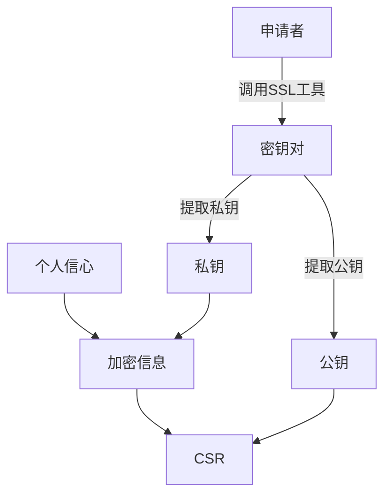
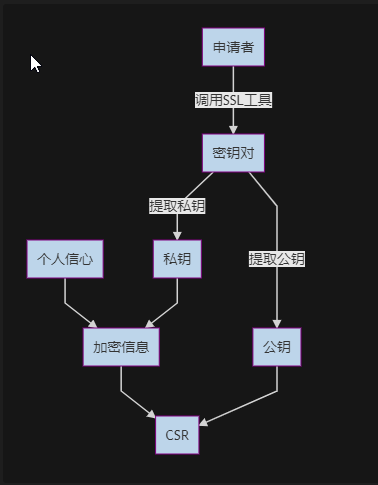

# 证书认证流程

## SSL相关概念

* KEY
* CSR
* 证书
  * 格式
    * crt / cer
      * pem
      * der
    * pfx
  * 公钥
  * 签名算法
  * 指纹
  * 指纹算法
* X.509
* PKCS
* 证书的有效性验证
* 问题
* 流程示例

### KEY

* 非对称加密私钥，如RSA的私钥
* 生成方式

  ```sh
  openssl genrsa -out openssl.key 1024
  ```
  
### CSR

* Certificate Signing Request， 证书签名请求文件
* 证书申请者将CSR提供给证书颁发机构，获取证书
* 我们可以认为csr是一个待授权(公信机构签名)的证书

#### 如何生成CSR文件

* 开源工具，openssl工具，keystore explore，XCA等，[在线工具](https://myssl.com/csr_create.html)
* 需要填写正确的域名
* 密钥算法如果是RSA，需要保证密钥长度不小于2048，默认是2048
* 摘要签名，一般使用sha2-256,[摘要算法](https://segmentfault.com/a/1190000009085862)
* 生成csr
  ```sh
  openssl req -new -key server.key -out server.csr
  ```

### 证书

#### 格式

* cer, 微软系统使用的证书文件格式
* crt，多用于unix/linux系统
* pfx, 以PKCS#12标准定义的证书，包含公钥和私钥，cer/crt不包含私钥

#### 证书内容

可以概括为：用户信息，提供给用户的公钥，以及CA机构对证书的签名

* 证书的发布机构
* 证书的有效期
* 公钥，证书申请者的密钥对中的公钥
* 证书所有者（CSR信息中有提供）
* 签名所使用的算法
  * 指纹生成时，使用的加密算法 
* 指纹以及指纹算法
  * 指纹算法, 对证书进行hash生成摘要的算法
  * 指纹元数据，通过指纹算法生成的证书摘要
  * 证书中的指纹是指纹元数据被私钥加密后的结果，对证书的签名
  * 通过公钥和签名算法对指纹解密，可以得到指纹元数据，验证签名
  
！指纹的加密和解密，就是证书的签名和验证签名，涉及的密钥对是CA颁发者提供的，例如根证书或者中间证书


#### 证书生成方式

* 生成CA证书
  ```sh
  openssl req -new -x509 -key ca.key -out ca.crt -days 3650 -subj /CN=baidu.com
  ```
  * -x509，表示证书格式为509
  * CN, ssl认证时，为https域名
  * -subj 证书持有者
* 颁发证书
  ```sh
  openssl x509 -req -days 3650 -in target.csr \
  -CA ca.crt -CAkey ca.key \
  -CAcreateserial -out server.crt
  ```
### PKCS

* Public Key Cryptography Standards
* pkcs12描述了存储私钥，公钥，证书，以及个人信息的语法


## 问题

### 证书验证逻辑

* 证书中的指纹如何被解密
  * 解密使用的公钥是哪一个 -- 证书颁发机构(CA机构)使用颁发证书时的密钥对，通过密钥对的公钥对颁发的证书进行指纹验证
  
### 证书请求文件构建

* 构建证书请求文件为什么需要私钥 -- 通过私钥加密数据，这样做可以防止信息被破坏或篡改
* 证书请求文件中的内容 -- 申请者信息，公钥信息

### PKCS12

* 标准的具体内容 -- 用于存储私钥，公钥，证书，以及其他个人信息，同时具备加密存储的能力，个人理解用于防止单独文件存放时，直接暴露信息在存储介质中
* 为什么需要携带客户端私钥 -- 这只是一个存储加密工具的一个标准，标准中规定了存放私钥的方法。 这个存放标准能更安全的存储密钥对等敏感信息

### CA机构颁发证书

* CA机构办法的证书如何使用？ --  证书申请者通过csr向CA申请证书， 例如，公司向CA申请证书， 公司的APP向公司服务器获取证书，用于建立ssl, 此时的证书就是公司从CA申请的证书；
* 如何验证从CA申请的证书？ -- CA机构会提供根证书或中间证书，用于验证用户手中的证书是否为CA机构颁发的证书
* 通过csr申请的证书，含有的公钥信息是如何提供的？ -- csr中包含有公钥，CA会对csr中的信息进行签名，以证书的形式发送给申请者
* CA证书中，验证签名（解密指纹）的公钥和证书中的公钥是同一个吗？ -- 证书中的公钥是申请者对应公钥，验证签名(解密指纹)的公钥是CA签发证书时，根证书(签发者)的公钥

### 证书格式的理解

* der, pem, pfx, x.509 区别
  * der,pem,pfx是文件后缀名，x.509是一个证书的某个类型
  * der 和 pem 是数据存储格式，der为二进制存储， pem是特定格式的base64编码存储
  * x.509是证书的内容规范，包含拿些信息，针对的是证书的信息
  * pfx是按照pkcs12标准组织的数据，以pfx格式存储
  

### 公钥基本结构(PKI)是什么

* 密钥对 -- 用于非对称加密，保证数据传输过程是加密的
* CA认证 -- 密钥对中的公钥和持有私钥的持有者信息，需要被证明有效的，同过CA机构来认证这些信息
* CA证书 -- 通过CA认证的最终产物，包含明文的公钥和私钥持有者信息，以及对这些信息的签名

## 流程示例

### 创建证书签名申请



### 申请证书

```sequence
    participant server
    participant AC颁发机构
    server->>AC颁发机构:CSR
    
    Note right of AC颁发机构:CSR公钥解密个人信息
    Note right of AC颁发机构:ca.crt签名CSR数据

    AC颁发机构->>server:server证书

```

### 验证证书

```sequence
    participant client
    participant server
    participant AC颁发机构
    server->>client:server证书
    Note left of client:读取CA证书指纹
    AC颁发机构->>client:ca.crt
    Note left of client:使用ca.crt验证指纹A
    Note left of client:获取指纹算法
    Note left of client:计算证书指纹B
    Note left of client:指纹A,B对比
```

